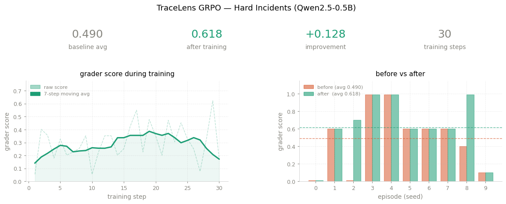

# TraceLens: Training an LLM to Debug Backend Incidents

Debugging a production failure is not a single-step problem. Engineers start with an alert, dig through logs, cross-reference metrics, follow signals across services, and only then form a hypothesis about what broke. It's a process of elimination under uncertainty — and it's nothing like the tasks most LLM benchmarks test.

TraceLens is an interactive environment designed to train and evaluate agents on exactly this kind of reasoning.

---

## The Problem

LLMs are good at answering questions when the answer is already implicit in the prompt. What they struggle with is *working toward* an answer: deciding which information to collect, recognizing when a signal is a red herring, and knowing when they have enough evidence to commit.

These are the core skills of incident diagnosis — and they're almost completely absent from standard evaluation setups, which tend to favor one-shot, static reasoning.

---

## The Environment

Each TraceLens episode begins with an alert, something like:

> "Elevated 500 errors in the checkout service"

The agent has four tools available: `open_logs(service)`, `scroll_logs()`, `view_metrics(service)`, and `submit_diagnosis()`. It never sees the full system state at once. It builds its picture step by step, the same way a real engineer would.

The design is deliberately constrained. `scroll_logs()` moves backward through the currently open service's logs and can't be undone. `Max steps` per task is capped and agent is cut off from uploading more steps after. These constraints force the agent to make real decisions about where to look and in what order — not just exhaust every option.

Hard tasks add noise: INFO and WARN messages mixed in with actual errors, metric spikes that aren't the root cause, timeouts in one service that are actually caused by a dependency somewhere else. The agent has to verify, not just pattern-match.

---

## Training Setup

The environment runs as a Hugging Face Space with a REST API. Training happens locally (or on a rented GPU) using [Unsloth](https://github.com/unslothai/unsloth) and GRPO from TRL.

Rather than training on a static dataset, the model collects its own experience by interacting with the environment. Rewards are structured to encourage good behavior at every step: small rewards for discovering new signals, penalties for redundant actions, and a larger grader reward for a correct final diagnosis.

We used Qwen2.5-0.5B-Instruct — a small model — to keep training fast and demonstrate that the approach works even at this scale. The full training run takes under an hour on an A100.

---

## Results

Before training, the model's behavior on hard tasks was inconsistent. It frequently submitted diagnoses too early, before gathering enough evidence, and had no clear strategy for navigating across services.

After 30 training steps, the average grader score on hard tasks improved from **0.490 to 0.618** — a delta of +0.128. More notably, the 0.618 post-training score is higher than the baseline produced by GPT-4o-mini (0.504 through inference.py) in a multi-agent setup on the same task set. The improvement isn't just in the score; the agent's behavior changes. It explores more services before committing, and it's less likely to latch onto the first plausible signal it finds.

---

## Why This Matters

If LLMs are going to be useful in real operational contexts, they need to do more than retrieve answers. They need to handle uncertainty, interact with tools over multiple steps, and build up internal state as they go.

TraceLens is a small step toward making that trainable and measurable. The environment is synthetic and the model is small, but the core result holds: this kind of investigative behavior can be learned from interaction. You don't need a massive model or a massive dataset — you need the right reward signal and an environment that actually tests what you care about.

Most benchmarks ask whether a model can answer a question. TraceLens asks whether it can figure one out.

---

## Limitations

The logs and incidents are synthetic, the service graphs are small, and the trained model is nowhere near the capability of a real SRE. The goal here wasn't to build a production tool — it was to show that a training signal for this kind of reasoning is achievable, and to provide an environment others can build on.

---

## Try It

- **Environment**: [TraceLens on HF Spaces](https://huggingface.co/spaces/sammyurfen/tracelens)
- **Training script**: included in the [repo](https://github.com/SammyUrfen/TraceLens) — end-to-end improvement in under an hour using Unsloth + TRL